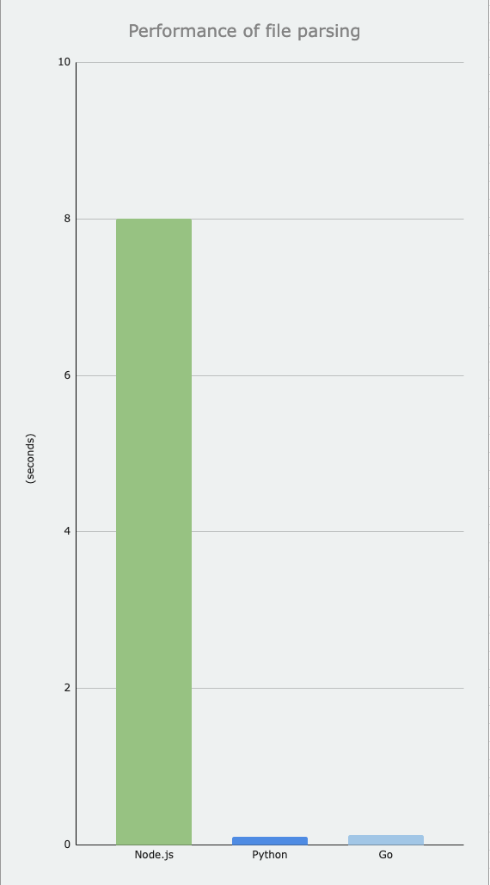

##Parsing file performance test

File size: **15MB**

Iterations: **10**

Rows in file: **100000**

*Time iteration in seconds*

| Node.js | Python  | Go      |
|---------|---------|---------|
| 7.772   | 0.105   | 0.128   |
| 7.31    | 0.102   | 0.16    |
| 8.728   | 0.099   | 0.117   |
| 8.177   | 0.095   | 0.145   |
| 8.268   | 0.092   | 0.115   |
| 7.943   | 0.092   | 0.109   |
| 7.877   | 0.099   | 0.105   |
| 7.795   | 0.13    | 0.116   |
| 7.987   | 0.105   | 0.124   |
| 8.109   | 0.093   | 0.118   |
| **Average** | **Average** | **Average** |
| 7.9966  | 0.1012  | 0.1237  |

